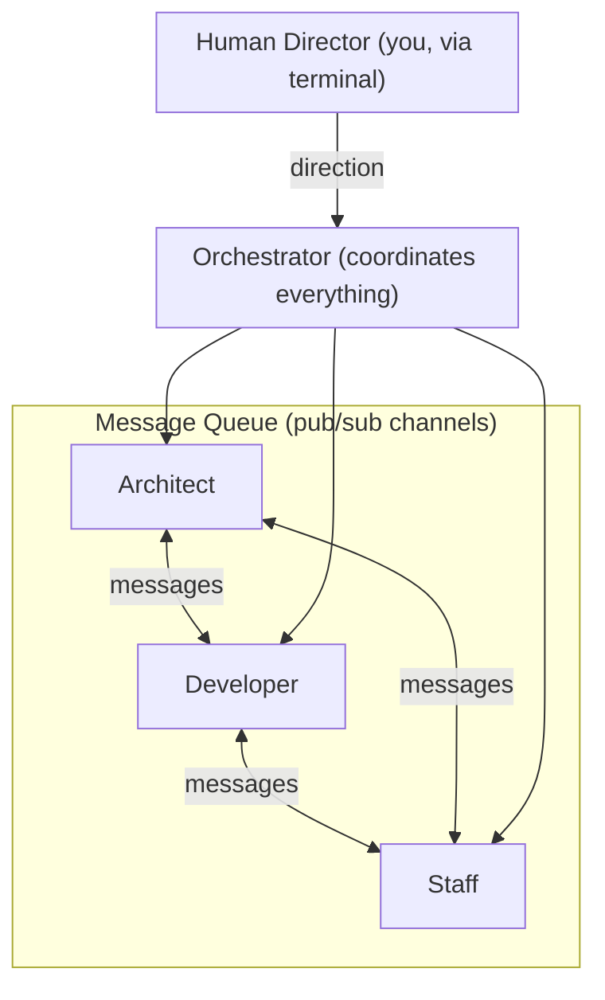
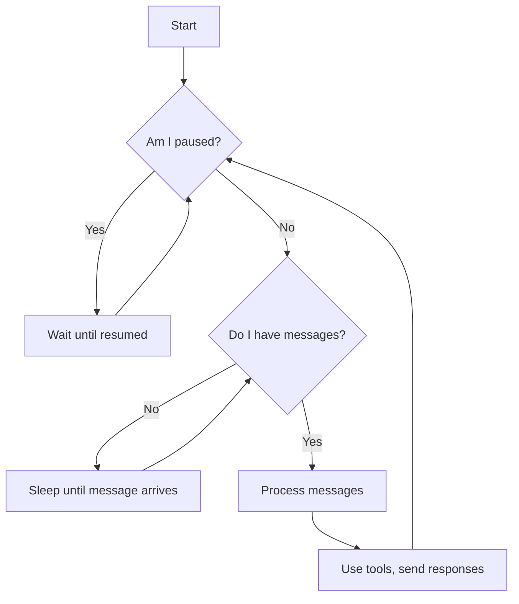
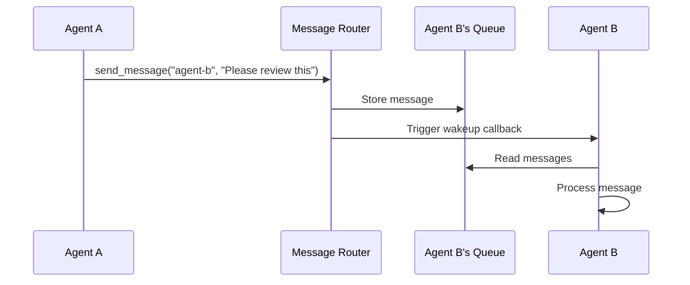
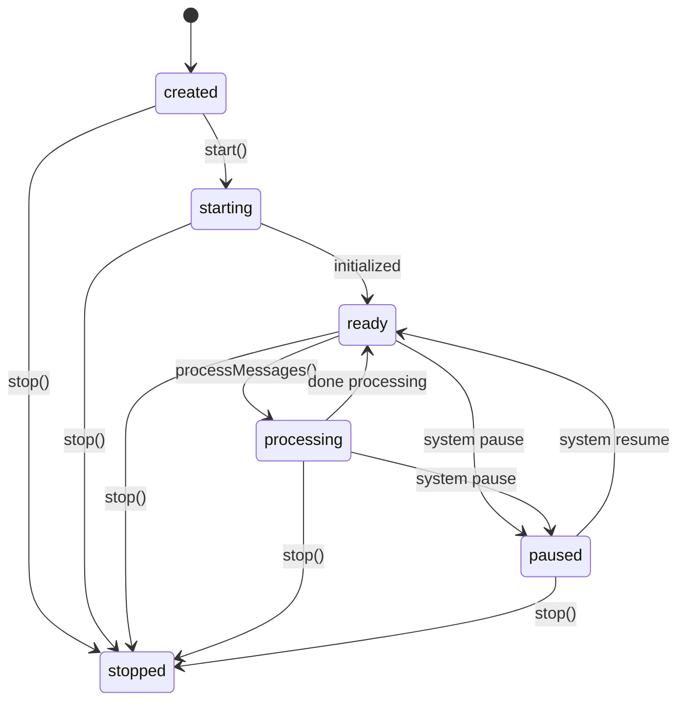
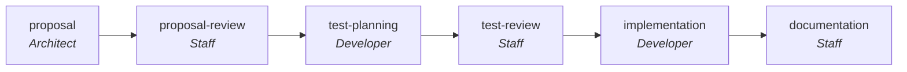
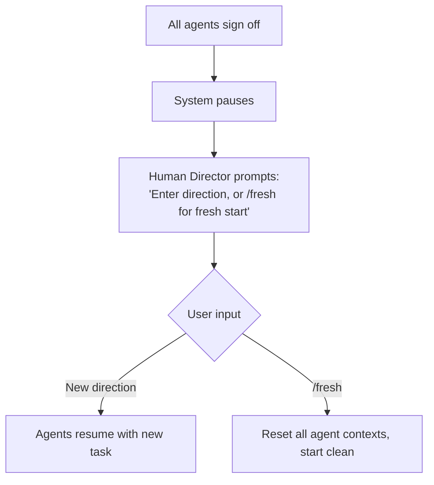
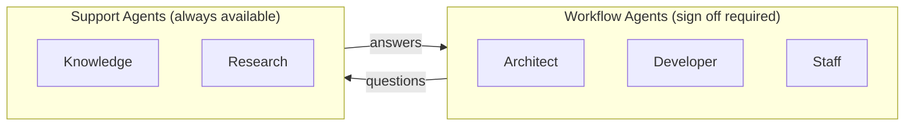

# Gimbal Architecture Guide

This guide explains how Gimbal's control loop and state machine work, and how to extend it with custom workflows.

## Overview

Gimbal is a multi-agent orchestration system where AI agents collaborate to complete software engineering tasks. Think of it as a virtual team where each agent has a specific role (architect, developer, staff engineer) and they communicate through messages.



## The Event Loop

### How Agents Work

The system runs an **event-driven loop** - agents don't constantly check for work. Instead, they sleep until a message arrives, then wake up to process it.



**Why this matters**: The system is efficient. Agents don't waste CPU cycles polling. They wake instantly when there's work to do.

### Message Flow

When Agent A sends a message to Agent B:



## State Machines

There are two state machines: one for individual agents, one for the overall workflow.

### Agent Lifecycle States

Each agent has a lifecycle state:



| State | Meaning |
|-------|---------|
| `created` | Agent exists but hasn't started |
| `starting` | Agent is initializing (loading tools, connecting to Claude) |
| `ready` | Agent is waiting for messages |
| `processing` | Agent is actively working on messages |
| `paused` | Agent is paused (via `/pause` command) |
| `stopped` | Agent has been shut down |

### Workflow Phases

The workflow progresses through phases. Each phase has an owner and produces specific artifacts:



| Phase | Owner | What Happens |
|-------|-------|--------------|
| `proposal` | Architect | Explores codebase, identifies problem, proposes solution |
| `proposal-review` | Staff | Reviews proposal, approves or requests changes |
| `test-planning` | Developer | Designs test plan to verify the solution |
| `test-review` | Staff | Reviews test plan, approves or requests changes |
| `implementation` | Developer | Writes code, runs tests |
| `documentation` | Staff | Updates CHANGELOG, writes retrospective |

### Workflow Completion

When all **workflow agents** finish their work, they "sign off". Support agents (like knowledge or research) don't participate in sign-off:



## Communication Patterns

Agents communicate in three ways:

### 1. Direct Messages
One agent to another:
```
send_message("developer", "Please implement the login feature")
```

### 2. Channel Publishing
Broadcast to all subscribers of a channel:
```
subscribe("#planning")           // Join the channel
publish("#planning", "Proposal: Add caching layer")  // Everyone subscribed sees this
```

### 3. Broadcast
Send to all agents:
```
broadcast("System maintenance in 5 minutes")
```

### Messaging Tools

Agents have access to these built-in messaging tools:

| Tool | Description |
|------|-------------|
| `send_message(to, content)` | Send a direct message to another agent |
| `broadcast(content)` | Send to all agents except yourself |
| `subscribe(channel)` | Join a channel (creates it if needed) |
| `unsubscribe(channel)` | Leave a channel |
| `publish(channel, content)` | Broadcast to all channel subscribers |
| `list_agents()` | List all available agents |
| `list_channels()` | List active channels and your subscriptions |
| `sign_off()` | Signal completion (workflow agents only) |

### Channels

The default workflow uses these channels:

| Channel | Purpose | Subscribers |
|---------|---------|-------------|
| `#planning` | Proposals, reviews, coordination | architect, developer, staff |
| `#implementation` | Code changes, test results | developer, staff |
| `#knowledge` | Codebase questions | knowledge agent |
| `#research` | External research requests | research agent |
| `#errors` | Error visibility | staff, research |

Channels are created automatically when an agent subscribes and removed when empty.

## Agent Types

There are two types of agents:

### Workflow Agents
- Participate in workflow phases (proposal → implementation → documentation)
- Can call `sign_off()` to signal completion
- System waits for ALL workflow agents to sign off before prompting human
- Examples: architect, developer, staff

### Support Agents
- Always available helpers that don't block workflow
- Cannot sign off (don't participate in completion tracking)
- Typically listen on dedicated channels for questions
- Examples: knowledge (codebase docs), research (external info)



## Available Commands

As a human operator, you can control the system with slash commands:

| Command | Action |
|---------|--------|
| `/help` | Show available commands |
| `/status` | Display current workflow state, agent states, channels |
| `/pause` | Pause all agents (they stop processing) |
| `/resume` | Resume paused agents |
| `/fresh` | Reset all agent contexts (start over) |
| `/quit` | Exit the system |

Any other text you type becomes "direction" broadcast to all agents.

**Input Safety**: Short ambiguous inputs (like "a", "y", "n", "ok") require confirmation before broadcasting, preventing accidental commands from being sent as direction.

## Extension Points

Here's where you can customize Gimbal:

### 1. Add New Agent Roles

In `index.ts`, add a new agent configuration:

```typescript
{
  id: "security-reviewer",
  name: "Security Reviewer",
  systemPrompt: `You are a security expert. Review code for vulnerabilities...`,
  model: "sonnet",
  agentType: "workflow",  // or "support" for always-available helpers
  tools: ["Read", "Glob", "Grep"],
}
```

**Agent Types:**
- `workflow`: Participates in phases, can sign off, counts toward completion
- `support`: Always available helper (like a knowledge agent), doesn't block workflow

### 2. Add New Workflow Phases

In `types.ts`, extend the `WORKFLOW_PHASES` constant:

```typescript
{
  id: "security-review",
  name: "Security Review",
  owner: "security-reviewer",
  requiredPriorPhases: ["implementation"],
  produces: ["security-report"],
  completionCriteria: "Security review approved",
}
```

### 3. Add New Slash Commands

In `human-director.ts`, add a callback property and setter:

```typescript
private myCommandCallback: (() => void) | null = null;

onMyCommand(callback: () => void): void {
  this.myCommandCallback = callback;
}
```

Then add the case in `handleCommand()`:

```typescript
case "mycommand":
  this.myCommandCallback?.();
  break;
```

Finally, wire it up in `orchestrator.ts` constructor:

```typescript
this.humanDirector.onMyCommand(() => {
  // Your command logic here
  console.log("My command executed!");
});
```

### 4. Add New Messaging Tools

In `agent-lifecycle.ts`, within `createMessagingServer()`:

```typescript
{
  name: "request_review",
  description: "Request a code review from staff",
  inputSchema: { ... },
  async handler(args) {
    // Custom logic here
    return { content: [{ type: "text", text: "Review requested" }] };
  }
}
```

### 5. Add External Tool Servers (MCP)

Agents can use external tools via MCP servers. In agent config:

```typescript
{
  id: "researcher",
  name: "Researcher",
  systemPrompt: "You research topics using web search...",
  agentType: "support",
  mcpServers: {
    "web-search": {
      command: "npx",
      args: ["-y", "@anthropic/mcp-server-web-search"],
      env: {  // optional environment variables
        API_KEY: process.env.SEARCH_API_KEY || "",
      },
    },
  },
}
```

The agent can then use tools like `mcp__web-search__search`.

**Built-in MCP integrations:**
- **Context7** (`@upstash/context7-mcp`) - Library documentation lookup
- **Perplexity** (`@perplexity-ai/mcp-server`) - Real-time web search

## Writing Custom Workflows

To create a custom workflow:

### Step 1: Define Your Phases

Think about what stages your workflow needs:

```
Example: Bug Fix Workflow
1. triage       - Understand the bug
2. reproduce    - Create reproduction steps
3. fix          - Implement the fix
4. verify       - Run tests, confirm fix
5. document     - Update docs if needed
```

### Step 2: Define Your Agents

What roles do you need?

```typescript
const agents = [
  { id: "triager", name: "Bug Triager", tools: ["Read", "Grep"], agentType: "workflow" },
  { id: "fixer", name: "Bug Fixer", tools: ["Read", "Edit", "Write", "Bash"], agentType: "workflow" },
  { id: "verifier", name: "QA Verifier", tools: ["Read", "Bash"], agentType: "workflow" },
];
```

### Step 3: Write System Prompts

Each agent needs clear instructions:

```typescript
{
  id: "triager",
  systemPrompt: `You are a bug triager. Your responsibilities:
1. Read the bug report carefully
2. Search the codebase to understand the affected area
3. Classify severity (critical/high/medium/low)
4. Write a clear summary for the fixer

When done, publish your analysis to #bugs and sign off.`,
}
```

### Step 4: Set Up Channels

Subscribe agents to relevant channels:

```typescript
// In createGimbal() or index.ts
orchestrator.subscribeAgentToChannel("triager", "#bugs");
orchestrator.subscribeAgentToChannel("fixer", "#bugs");
orchestrator.subscribeAgentToChannel("verifier", "#bugs");
```

### Step 5: Define Checkpoints (Optional)

For quality gates, use the checkpoint system:

```typescript
// Agent requests approval
const checkpointId = await checkpoint.requestApproval("fix", artifactRef);

// Approver reviews and approves/rejects
checkpoint.approve(checkpointId, "Fix looks good");
// or
checkpoint.reject(checkpointId, "Missing edge case handling");
```

## Key Files Reference

| File | Purpose |
|------|---------|
| `index.ts` | Agent configurations, workflow setup |
| `orchestrator.ts` | Main control loop, coordinates everything |
| `agent-lifecycle.ts` | Individual agent behavior, tool definitions |
| `human-director.ts` | Terminal input handling, slash commands |
| `input-parser.ts` | Parses commands vs directions, detects suspicious input |
| `message-router.ts` | Routes messages between agents |
| `message-store.ts` | Per-agent message queues |
| `channel-registry.ts` | Manages pub/sub channels |
| `sign-off-tracker.ts` | Tracks workflow agent sign-offs |
| `types.ts` | All type definitions, workflow phases |
| `checkpoint.ts` | Quality gates for approvals |
| `artifact.ts` | Tracks work products (proposals, implementations) |
| `cli.ts` | Command-line interface and argument parsing |

## Debugging Tips

1. **Check workflow state**: Use `/status` to see current phase and agent states

2. **Watch message flow**: The orchestrator logs message delivery:
   ```
   [Orchestrator] architect: Analyzing codebase structure...
   ```

3. **Agent not responding?** Check if:
   - System is paused (`/status` shows `Paused: true`)
   - Agent has correct channel subscriptions
   - Agent's tools array includes needed tools

4. **Reset if stuck**: Use `/fresh` to reset all agent contexts

## Summary

- **Event Loop**: Agents sleep until messages arrive, then wake to process
- **Two State Machines**: Agent lifecycle (created→ready→processing→paused) and workflow phases
- **Agent Types**: Workflow agents (sign off required) vs support agents (always available)
- **Communication**: Direct messages, channels (pub/sub), or broadcast
- **Extension**: Add agents, phases, commands, MCP servers, or messaging tools
- **Control**: Use slash commands (`/status`, `/pause`, `/resume`, `/fresh`)

The system is designed to be extended. Start by understanding the existing workflow, then customize agents and phases for your needs.
